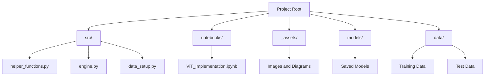
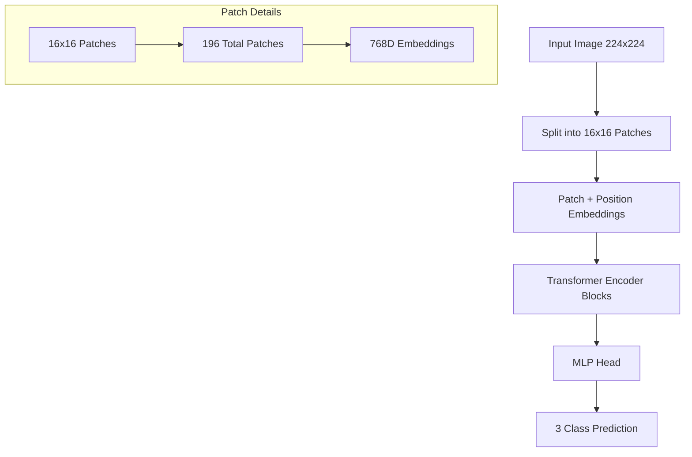
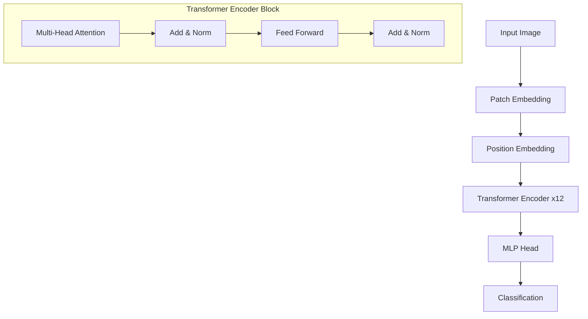

# Vision Transformer (ViT) Implementation 🚀

<div align="center">


<br>

[](https://www.python.org/)
[](https://pytorch.org/)
[](LICENSE)
[](https://huggingface.co/models)

</div>

<div align="center">
<h3>🎯 A PyTorch Implementation of the Vision Transformer (ViT) Paper</h3>
<h4><i>"An Image is Worth 16x16 Words: Transformers for Image Recognition at Scale"</i></h4>
</div>

---

<div align="center">

### 🌟 Key Features

| Feature | Description |
|---------|------------|
| 🔨 **Complete ViT** | Full implementation of Vision Transformer |
| 📊 **Custom Pipeline** | Flexible training and data processing |
| 🎯 **Fine-tuning** | Support for transfer learning |
| 📈 **Visualization** | Comprehensive model insights |
| 🤗 **HuggingFace** | Pre-trained model integration |
| 🖼️ **Custom Datasets** | Support for custom image data |

</div>

---

## 📚 Contents

<details>
<summary>Click to expand</summary>

- [Overview](#-overview)
- [Dataset Description](#-dataset-description)
- [Implementation Details](#-implementation-details)
- [Model Architecture](#-model-architecture)
- [Training Process](#-training-process)
- [Results](#-results)
- [Pre-trained Models](#-pre-trained-models)
- [Installation](#-installation)
- [Usage](#-usage)
- [Contributing](#-contributing)
- [License](#-license)

</details>

## 🎯 Dataset: FoodVision Mini

<div align="center">

### 🍽️ Three-Class Food Classification

<table>
<tr>
<td align="center">🍕 Pizza</td>
<td align="center">🥩 Steak</td>
<td align="center">🍣 Sushi</td>
</tr>
<tr>
<td></td>
<td></td>
<td></td>
</tr>
</table>

</div>

## 💫 Model Architecture

<div align="center">

### 🔄 Vision Transformer Pipeline


### 🧩 Patch Embedding Process

<table>
<tr>
<td></td>
<td></td>
<td></td>
</tr>
<tr>
<td align="center"><i>Image Patches</i></td>
<td align="center"><i>Feature Maps</i></td>
<td align="center"><i>Embeddings</i></td>
</tr>
</table>

### 🔍 Transformer Encoder


</div>

## 📊 Training Results

<div align="center">

### 📈 Performance Metrics

<table>
<tr>
<td>

<br>
<i>Training Progress</i>
</td>
<td>

<br>
<i>Model Metrics</i>
</td>
</tr>
</table>

### 🎯 Model Performance

| Metric | Value |
|--------|--------|
| Training Accuracy | 98% |
| Validation Accuracy | 91% |
| Model Size | 327MB |
| Training Time | ~30 min (CUDA) |

</div>

## 🚀 Pre-trained Model Results

<div align="center">

### 🔄 Transfer Learning Performance

<table>
<tr>
<td>

<br>
<i>Pre-trained Model Results</i>
</td>
<td>

<br>
<i>Performance Curves</i>
</td>
</tr>
</table>

</div>

## 🌟 Overview

This project implements the Vision Transformer (ViT) architecture from scratch using PyTorch, following the original paper ["An Image is Worth 16x16 Words: Transformers for Image Recognition at Scale"](https://arxiv.org/abs/2010.11929). The implementation includes both training from scratch and utilizing pre-trained models from HuggingFace.

### Key Features:
- 🔨 Complete implementation of ViT architecture
- 📊 Custom training pipeline
- 🎯 Fine-tuning capabilities
- 📈 Performance visualization
- 🤗 Integration with HuggingFace models
- 🖼️ Support for custom image datasets

## 🎯 Dataset Description

This implementation uses a focused subset of food images consisting of three specific classes:
1. 🍕 Pizza
2. 🥩 Steak
3. 🍣 Sushi

### Dataset Details:
- **Source**: Custom FoodVision Mini dataset
- **Classes**: 3 (Pizza, Steak, Sushi)
- **Image Size**: 224x224 pixels
- **Format**: RGB images
- **Split Ratio**: 80% training, 20% testing

### Sample Images:
<div align="center">


*Example of a single image from our dataset*

</div>

### Data Distribution:
```
Dataset Structure:
└── data/
    ├── train/
    │   ├── pizza/
    │   ├── steak/
    │   └── sushi/
    └── test/
        ├── pizza/
        ├── steak/
        └── sushi/
```

## 🗂 Project Structure



## 💡 Implementation Details

### 1. Data Processing and Augmentation
The implementation processes the food images through several stages:

```python
# Data augmentation and preprocessing pipeline
transform_train = transforms.Compose([
    transforms.Resize((224, 224)),
    transforms.RandomHorizontalFlip(p=0.5),
    transforms.RandomRotation(degrees=15),
    transforms.ToTensor(),
    transforms.Normalize(
        mean=[0.485, 0.456, 0.406],
        std=[0.229, 0.224, 0.225]
    )
])
```

#### Visualization of Data Processing Steps:
<div align="center">


*Process of converting an image into patches*


*Visualization of patches from the top row*


*Complete image broken down into patches*

</div>

### 2. Patch Embedding Process
The image patching process:

<div align="center">


*Patch Embedding class assertion and functionality*


*Visualization of flattened feature layer*


*Combined view of image, feature maps, and flattened representations*

</div>

Key implementation details:
- Input image size: 224x224 pixels
- Patch size: 16x16 pixels
- Number of patches: 196 (14x14)
- Embedding dimension: 768

### 3. Model Architecture Visualization



### 4. Training Results

#### Model Performance:
- **Training Accuracy**: ~98%
- **Validation Accuracy**: ~91%
- **Model Size**: 327MB
- **Training Time**: ~30 minutes on CUDA GPU

#### Loss and Accuracy Curves:
[PLACEHOLDER FOR TRAINING CURVES]

#### Feature Map Visualizations:
[PLACEHOLDER FOR FEATURE MAPS]

### 5. Inference Examples

Sample predictions on test images:
[PLACEHOLDER FOR INFERENCE EXAMPLES]

## 🚀 Training Process

The training implementation follows a comprehensive approach:

```python
# Training configuration
config = {
    "batch_size": 32,
    "learning_rate": 1e-3,
    "epochs": 10,
    "embedding_dim": 768,
    "num_heads": 12,
    "patch_size": 16,
    "num_classes": 3,  # Pizza, Steak, Sushi
    "dropout": 0.1
}
```

### Training Stages:
1. Data Preparation
   - Loading and preprocessing images
   - Splitting into train/test sets
   - Creating data loaders

2. Model Setup
   - Initializing ViT architecture
   - Setting up optimizer and loss function
   - Configuring learning rate scheduler

3. Training Loop
   - Forward pass
   - Loss calculation
   - Backpropagation
   - Parameter updates
   - Metrics tracking

4. Validation
   - Model evaluation
   - Performance metrics calculation
   - Best model checkpointing

## 🏗 Model Architecture

The complete ViT architecture:



### Position and Class Token Embedding:
<div align="center">


*Adding class token to patch embeddings*


*Expanding class embedding to match batch size*


*Adding positional embeddings to patches*

</div>

### Transformer Architecture:
<div align="center">


*Complete visual diagram of our Vision Transformer*


*Value transformations through MSA and MLP blocks*


*Summary of our custom encoder block*


*Implementation using PyTorch's transformer layers*

</div>

### Model Summary and Architecture:
<div align="center">


*Summary of our custom ViT model*

</div>

### Training Process:
<div align="center">


*Beginning of model training*


*Training progress and metrics*

</div>

### Training Results and Visualization:
<div align="center">


*Training and validation metrics over time*

</div>

### Pre-trained Model Integration:
<div align="center">


*Loading pretrained weights*


*Architecture of the pretrained model*


*Performance results with pretrained model*


*Performance plots for pretrained model*

</div>

### Model Deployment:
<div align="center">


*Saving the trained model to disk*


*Making predictions on new images*

</div>

### Feature Visualization:
<div align="center">


*Single image input visualization*


*Process of creating patches from image*


*Visualization of top row patches*


*Complete patch-wise decomposition*


</div>

## 🤗 Using Pre-trained Model

Integration with HuggingFace pre-trained models:
1. Model loading
2. Weight freezing
3. Fine-tuning process
4. Inference pipeline

```python
# Example of loading pre-trained model
pretrained_vit = torchvision.models.vit_b_16(weights=pretrained_vit_weights)
```

## 🛠 Installation

```bash
# Clone the repository
git clone https://github.com/yourusername/vit-implementation.git

# Install dependencies
pip install -r requirements.txt
```

Required dependencies:
- PyTorch >= 2.0
- torchvision
- numpy
- matplotlib
- requests
- tqdm

## 📝 Usage

```python
# Example usage
from vit_model import ViT

# Create model instance
model = ViT(
    img_size=224,
    patch_size=16,
    num_classes=1000,
    embedding_dim=768,
    num_heads=12,
    num_layers=12,
    hidden_dim=3072,
    dropout=0.1
)

# Train model
train_model(model, train_loader, val_loader, num_epochs=10)
```

## 🤝 Contributing

Contributions are welcome! Please feel free to submit a Pull Request.

## 📄 License

This project is licensed under the MIT License - see the [LICENSE](LICENSE) file for details.

---
## 🙏 Thank You 💫

<div align="center">

```ascii
⠀⠀⠀⠀⠀⠀⠀⠀⠀⠀⠀⠀⠀⠀⠀⠀⠀⣀⣀⣤⣀⢠⡤⠤⠖⠒⠒⠒⠲⣆⠀⠀⠀⠀⣾⠋⠉⠉⠛⢷⠀⣴⠖⠒⠤⣄⠀⣀⡀⠀⠀⠀⠀⠀⠀⠀⠀⠀⠀⠀
⠀⠀⠀⠀⠀⠀⠀⠀⠀⢀⣀⣤⠤⠶⢺⣾⣏⠁⠀⠀⣧⣼⣇⣀⠀⠀⠀⡀⠀⠘⡆⠀⠀⢰⣏⠀⠀⠀⠀⠘⣿⡟⠀⠀⢠⢃⣼⡏⠉⠙⢳⡆⠀⠀⠀⠀⠀⠀⠀⠀
⠀⠀⠀⠀⣀⡤⠴⠒⠋⠙⣇⣿⠀⠀⠀⣿⣿⠀⠀⠀⢸⣿⣿⣿⠃⠀⢰⣿⡀⠀⠹⡄⠀⢸⣿⠀⠀⠀⠀⠀⢹⡇⠀⠀⢸⡿⣽⠀⠀⠀⡜⠀⣀⡤⠖⠓⠢⢤⣀⠀
⣠⡴⠒⠉⠁⠀⠀⠀⠀⠀⠸⣿⡇⠀⠀⠘⠛⠃⠀⠀⠈⡟⠉⣿⠀⠀⠘⠛⠃⠀⠀⢷⠀⢸⣿⠀⠀⢠⡀⠀⠀⠀⠀⠀⣿⢧⡇⠀⠀⠸⠗⠚⠁⠀⠀⠀⣀⣠⣾⠃
⣿⡇⠀⠀⠀⠀⠀⠀⣶⣶⣿⢿⢹⠀⠀⠀⢀⣀⠀⠀⠀⢳⠀⣿⠀⠀⢀⣀⣤⠀⠀⠘⣇⢸⡏⠀⠀⢸⣧⠀⠀⠀⠀⢸⣿⡿⠀⠀⢀⠀⠀⠀⢀⣤⣶⣿⠿⠛⠁⠀
⢧⣹⣶⣾⣿⡄⠀⠀⠸⡟⠋⠘⡜⡆⠀⠀⢻⣿⡇⠀⠀⢸⡀⣿⠀⠀⢸⣿⡿⡇⠀⠀⢸⣿⡇⠀⠀⢸⡿⡆⠀⠀⠀⣾⣿⠃⠀⠀⣾⡇⠀⠀⠈⡟⠉⠀⠀⠀⠀⠀
⠘⣿⡿⠿⢿⣧⠀⠀⠀⢳⡀⠀⣇⢱⠀⠀⠈⣿⣷⠀⣀⣸⣷⣿⣤⣤⣼⠋⣇⣹⣶⣶⣾⣿⡿⢲⣶⣾⡇⣿⣤⣀⣀⣿⡏⠀⠀⣼⡏⢧⠀⠀⠀⣇⠀⠀⠀⠀⠀⠀
⠀⠀⠀⠀⠸⡞⣇⠀⠀⠀⢧⠀⢸⣈⣷⣶⣶⣿⣿⣿⣿⣿⣿⣿⣽⣿⡏⢀⡼⠟⠛⠻⢿⡿⠿⠿⣿⣁⣿⣿⣿⣿⣿⣿⣿⣶⣴⢿⠁⢸⠀⠀⠀⢸⠀⠀⠀⠀⠀⠀
⠀⠀⠀⠀⠀⢹⣼⣦⣤⣶⣿⠁⣀⣿⠿⠿⣿⣫⣿⠉⠁⠀⠀⠀⡏⠀⣴⠏⠀⠀⠀⠀⠀⠹⣆⠀⢠⣿⠀⠀⠀⢈⠟⢻⡿⠿⣅⣘⡆⣸⣇⠀⠀⢸⠀⠀⠀⠀⠀⠀
⠀⠀⠀⠀⠀⠀⠻⠿⠿⠛⠃⢠⣿⣷⣄⠀⠈⠙⠋⠀⠀⠀⠀⣸⢁⡾⠁⠀⠀⣠⣤⡀⠀⠀⠸⣤⡞⡇⠀⠀⠀⢸⣰⣿⠃⠀⠀⢹⣿⣿⣿⣿⣦⣼⠀⠀⠀⠀⠀⠀
⠀⠀⠀⠀⠀⠀⠀⠀⠀⠀⠀⠻⢿⣿⣿⣷⣄⠀⠀⠀⠀⠀⠀⣿⣾⠇⠀⠀⣸⣿⣿⢿⠀⠀⠀⣿⢁⡇⠀⠀⢀⣿⣿⡏⠀⠀⠀⡼⠀⢙⣿⠛⠻⣏⡀⠀⠀⠀⠀⠀
⠀⠀⠀⠀⠀⠀⠀⠀⠀⠀⠀⠀⠀⠙⢿⣿⣿⣷⠀⠀⠀⠀⢸⡿⡿⠀⠀⠀⡏⢹⠟⡟⠀⠀⠀⡿⢸⠀⠀⠀⢸⣿⡿⠀⠀⠀⢠⠇⡰⢋⡏⠀⠀⠀⢙⡆⠀⠀⠀⠀
⠀⠀⠀⠀⠀⠀⠀⠀⠀⠀⠀⠀⠀⠀⠀⠙⡿⡿⠀⠀⠀⠀⣸⡇⡇⠀⠀⠀⠻⠾⠞⠁⠀⠀⢀⡇⡏⠀⠀⠀⢸⣿⠃⠀⠀⠀⡼⣰⠃⡞⠀⠀⠀⠀⡾⠁⠀⠀⠀⠀
⠀⠀⠀⠀⠀⠀⠀⠀⠀⠀⠀⠀⠀⠀⠀⢠⡇⡇⠀⠀⠀⠀⣿⣇⣷⠀⠀⠀⠀⠀⠀⠀⠀⠀⣼⣃⡇⠀⠀⠀⠀⠀⠀⠀⠀⣼⣷⠃⣼⡀⠀⠀⢀⡞⠁⠀⠀⠀⠀⠀
⠀⠀⠀⠀⠀⠀⠀⠀⠀⠀⠀⠀⠀⠀⠀⢸⢸⠃⠀⠀⠀⢀⡇⢿⣿⣧⣀⠀⠀⠀⠀⠀⣠⣾⣿⣿⣧⠀⠀⠀⠀⠀⠀⠀⣸⣿⣿⣿⣽⣿⣷⣤⡞⠁⠀⠀⠀⠀⠀⠀
⠀⠀⠀⠀⠀⠀⠀⠀⠀⠀⠀⠀⠀⠀⠀⣾⣼⣤⣶⣶⣶⡿⠁⠈⢿⣿⣿⣿⣿⣿⣿⣿⠿⠃⢸⣿⣿⣷⣤⣄⣀⣀⣤⣾⣏⣤⡟⠁⠀⠈⠻⡍⠀⠀⠀⠀⠀⠀⠀⠀
⠀⠀⠀⠀⠀⠀⠀⠀⠀⠀⠀⠀⠀⠀⠀⣿⠿⠿⠿⠟⠛⠁⠀⠀⠀⠉⠛⠛⠛⠛⠉⠁⠀⠀⠀⠙⠿⢿⣿⣿⡿⠿⠋⢀⣿⣿⣧⡀⠀⠀⣠⡇⠀⠀⠀⠀⠀⠀⠀⠀
⠀⠀⠀⠀⠀⠀⠀⠀⠀⠀⠀⠀⠀⠀⠀⠀⠀⠀⠀⠀⠀⠀⠀⠀⠀⠀⠀⠀⠀⠀⠀⠀⠀⠀⠀⠀⠀⠀⠀⠀⠀⠀⠀⠀⢿⣿⣿⣿⣿⠟⠋⠀⠀⠀⠀⠀⠀⠀⠀⠀
⠀⠀⠀⠀⠀⠀⠀⠀⠀⠀⠀⠀⠀⠀⠀⠀⠀⠀⠀⠀⠀⠀⠀⠀⠀⠀⠀⠀⠀⠀⠀⠀⠀⠀⠀⠀⠀⠀⠀⠀⠀⠀⠀⠀⠀⠈⠉⠉⠀⠀⠀⠀⠀⠀⠀⠀⠀⠀⠀⠀                                                         
```

Thank you for exploring this Vision Transformer implementation! If you find this project helpful, feel free to use it in your own Vision Transformer tasks. Your interest and support are greatly appreciated! 🌟